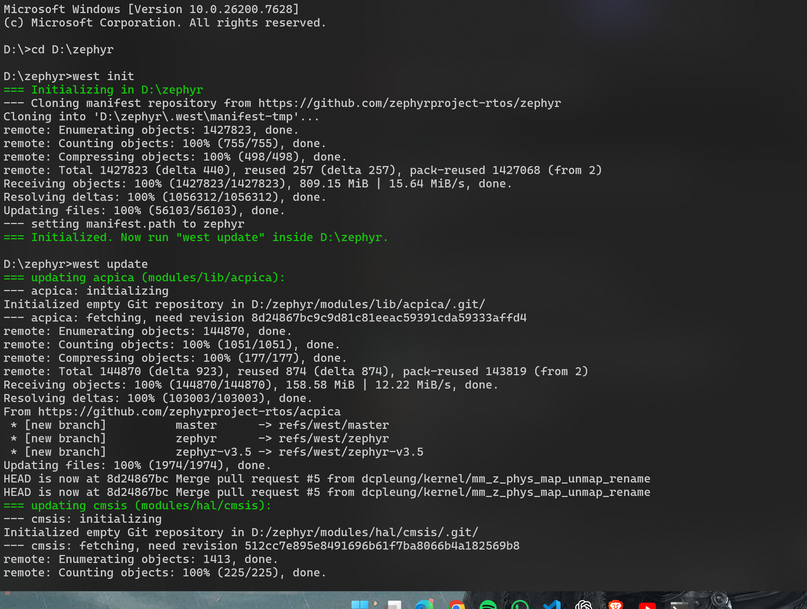
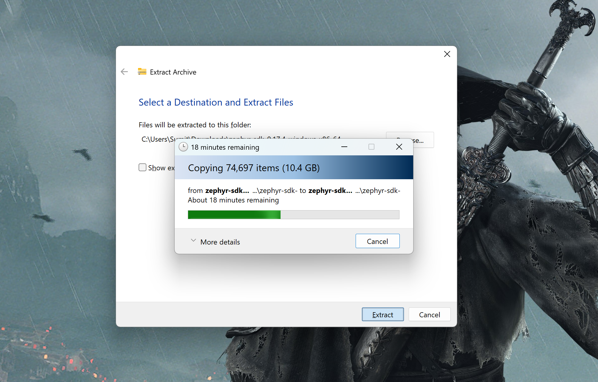
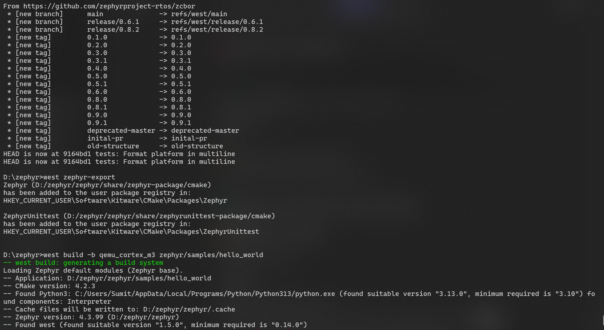
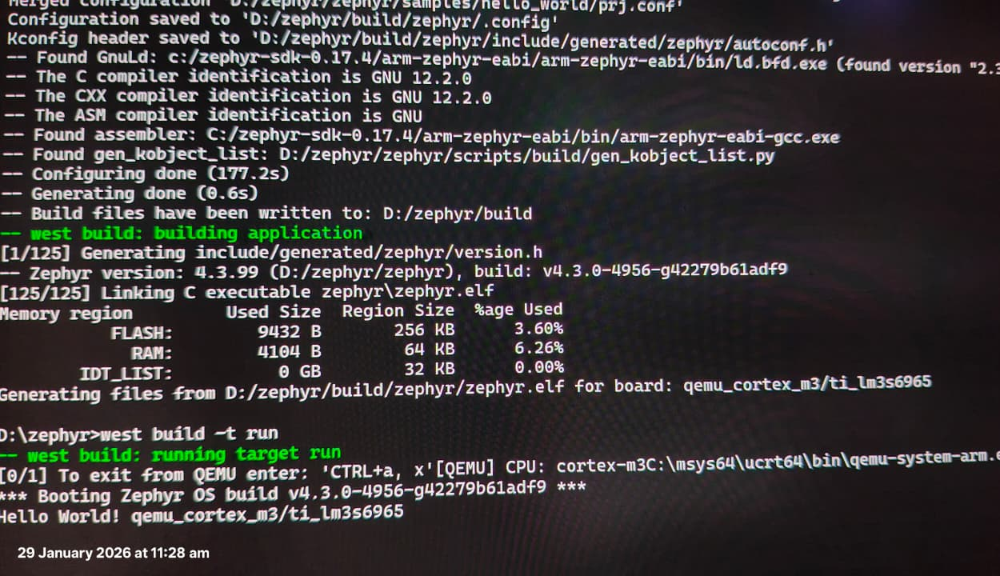
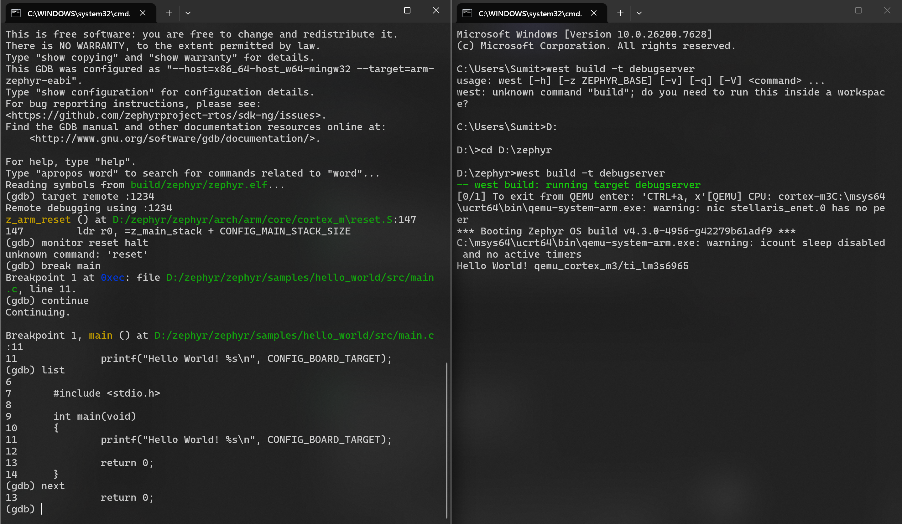

# 🧠 Zephyr RTOS Bring-Up and Debugging on ARM Cortex-M3 using QEMU

## 📌 Project Overview

This project documents the complete bring-up of the Zephyr RTOS on an ARM Cortex-M3 virtual board using QEMU. It covers SDK installation, toolchain setup, environment troubleshooting, building firmware, running it on an emulated target, and debugging the system using GDB.

The goal of this project was not just to run a sample, but to understand the real embedded workflow — from setting up the RTOS environment to debugging firmware at the instruction and source level.

---

## 🛠 Tech Stack

- Zephyr RTOS  
- ARM Cortex-M3  
- Zephyr SDK  
- QEMU  
- arm-zephyr-eabi-gdb  
- C, Python  
- CMake, West, Ninja  

---

## 🧩 Step-by-Step Engineering Journey

### 🔹 Step 1: Setting up Zephyr workspace

- Installed west, Python, and CMake  
- Initialized Zephyr workspace  
- Verified folder structure and environment  

📸 Screenshot: west init / workspace structure  

---

### 🔹 Step 2: Installing Zephyr SDK

- Downloaded Zephyr SDK bundle  
- Registered SDK using setup script  
- Faced missing host tools & environment issues  

📸 Screenshot: SDK extract and Github

---

### 🔹 Step 3: First build attempt & errors

- SDK not detected initially  
- Missing Python dependency (elftools)  
- Fixed environment variables and installed packages  
 
📸 Screenshot: successful build  
 

---

### 🔹 Step 4: Running on ARM Cortex-M3 using QEMU

Commands used:

west build -b qemu_cortex_m3 zephyr/samples/hello_world
west build -t run
Booted Zephyr on ARM Cortex-M3 emulated board

Verified execution through QEMU console

📸 Screenshot: Hello World running in QEMU

### 🔹 Step 5: Debugging with GDB

Started QEMU in debug mode

Attached arm-zephyr-eabi-gdb

Set breakpoints at main()

Stepped through boot and execution flow

📸 Screenshot: GDB breakpoint
📸 Screenshot: stepping into main

## 📚 What I Learned

    How RTOS bring-up works

    How firmware flows from reset handler to main()

    How embedded debugging is done using GDB

    How to troubleshoot real toolchain issues

    How Zephyr RTOS is structured

## 🎯 Why This Project Matters

This project gave me hands-on exposure to embedded systems bring-up, firmware debugging, and RTOS workflows. It closely reflects real-world embedded engineering practices and Arm ecosystem development
